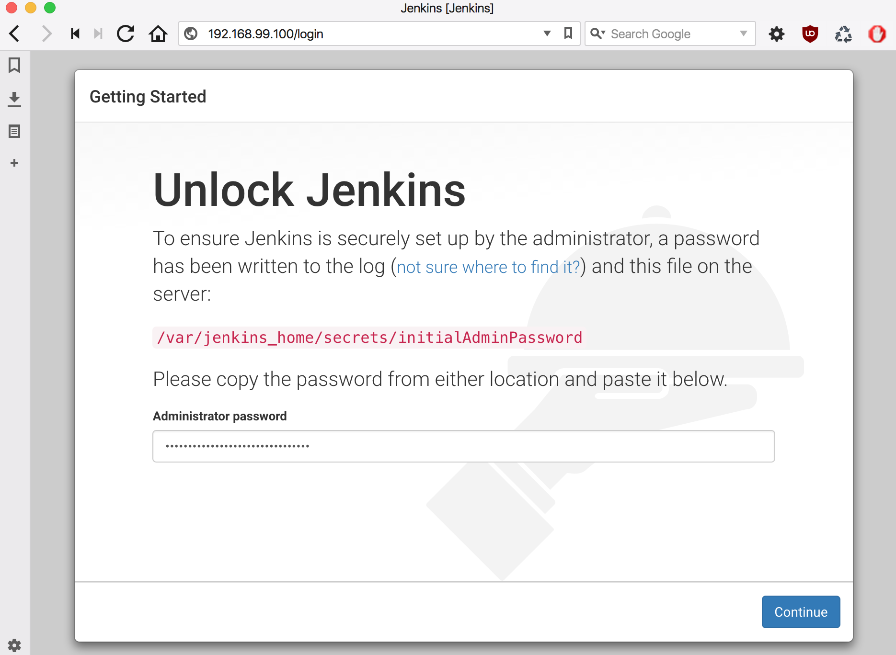
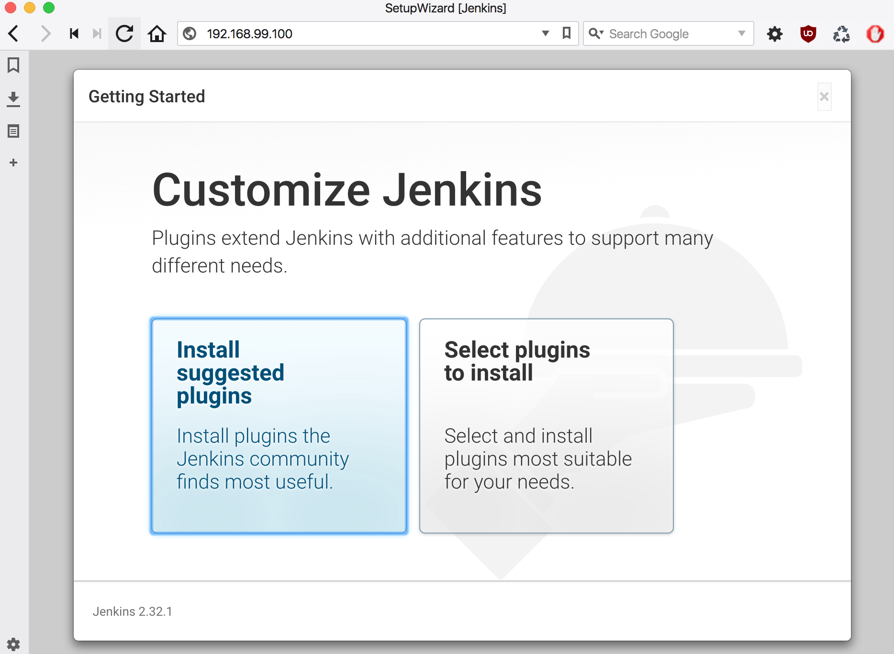
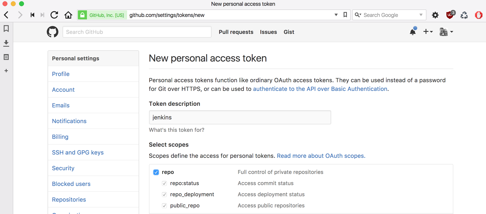
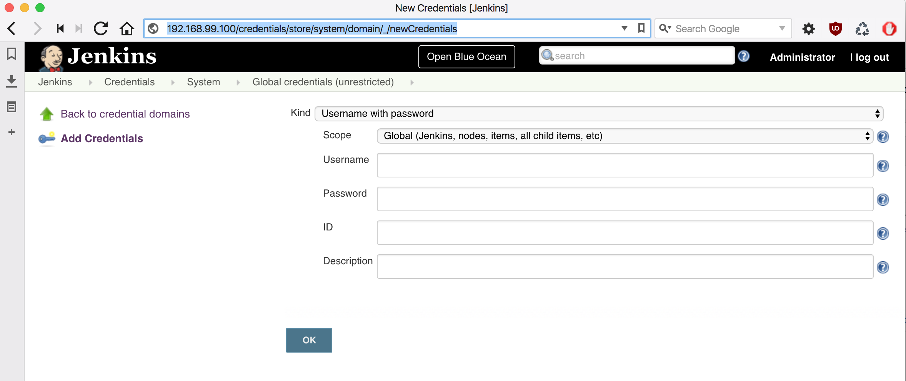

# Jenky


A configurable Docker-ized instance of Jenkins fronted by Nginx.
Convenient for vetting builds in a local development environment.

## Credits

Standing on the shoulders of giants.

I couldn't have scraped this together without
* [A. J. Ricoveri](https://github.com/axltxl/docker-jenkins-dood)
* [Stefan Prodan](https://github.com/stefanprodan/jenkins)
* [Riot Games Engineering](https://engineering.riotgames.com/news/jenkins-ephemeral-docker-tutorial)
* [Ryan J. McDonough](https://damnhandy.com/2016/03/06/creating-containerized-build-environments-with-the-jenkins-pipeline-plugin-and-docker-well-almost/)
* [Alex Ellis](http://blog.alexellis.io/jenkins-2-0-first-impressions/)


## Prerequisites

* Docker for Mac

If you happened to have previously installed [Docker Toolbox](https://www.docker.com/products/docker-toolbox), it will happily [co-exist](https://docs.docker.com/docker-for-mac/docker-toolbox/) with Docker for Mac.


## How to obtain the source

You'll use a git client.

#### with HTTPS

```
git clone https://github.com/fastnsilver/jenky.git
```

#### with SSH

```
git clone git@github.com:fastnsilver/jenky.git
```

## Installing Docker for Mac

You're on a Mac (aren't you?). Install [Docker for Mac](https://download.docker.com/mac/stable/Docker.dmg).
Note: Docker Compose also happens to come with Docker for Mac.

## Installing Docker for Linux

Do yourself a favor and spin up an [Ubuntu 16.04 LTS](http://releases.ubuntu.com/16.04/) Linux VM on Azure, AWS, or GCP. Then follow installation and pos-installation instructions:

* [Installation](https://docs.docker.com/engine/installation/linux/docker-ce/ubuntu/#install-using-the-convenience-script)
* [Post-installation](https://docs.docker.com/engine/installation/linux/linux-postinstall/)

To install Docker Compose, consult [these instructions](https://docs.docker.com/compose/install/).

Finally, you will need to add port 8081 in addition to port 80 to your provider's Firewall ingress rules if you intend to spin up an instance of Artifactory along with Jenkins.
 
 > For an example of how to get this done on GCP, consult this Stack Overflow [post](https://stackoverflow.com/questions/21065922/how-to-open-a-specific-port-such-as-9090-in-google-compute-engine)


## Prep Jenkins instance for first use

Create a new SSH key as described [here](https://help.github.com/articles/generating-a-new-ssh-key-and-adding-it-to-the-ssh-agent/). Name your private key `jenky_rsa`.

Run the following shell script

```
./bootstrap.sh
```

Visit `http://localhost` or the public IP address of the VM hosting your installation. (Or if you happen to be running Docker Toolbox, you're in a VM, so your IP address will be something like 192.68.99.100).

You will be prompted to enter a password that is to be retrieved from startup log.



To find it

```
docker exec master /bin/bash
cat /var/jenkins_home/secrets/initialAdminPassword
```

Enter the value in the `Administrator password` field and click `Continue`.


Next, you will be prompted to install plugins.  



You're advised to click `Install suggested plugins`.

Next, you will be prompted to create an `admin` account.


Click `Save and Finish`.

Upon completion of account creation you can administer your Jenkins instance manually with `Manage Jenkins`.

All updates are persisted to the `jenky_data-volume` volume.


## Pre-installing plugins

See [Plugin Index](http://updates.jenkins-ci.org/download/plugins/). Add a plugin id for each plugin you wish to install to `plugins.txt`.  You should do this before executing `bootstrap.sh`.  If you wish to install plugins after the image has been built, just do so via `Manage Jenkins > Manage Plugins`.


## Notes on images and volume

### jenky_master

Based on the official Jenkins Docker image [here](https://hub.docker.com/_/jenkins/).

### jenky_nginx

Based on [Alpine](https://hub.docker.com/_/alpine/) Linux distro [here](https://hub.docker.com/_/nginx/)

### jenky_slave

Based on [OpenJDK 8](https://hub.docker.com/_/openjdk/) and modeled closely after [jenkinsci/docker-ssh-slave](github.com/jenkinsci/docker-ssh-slave)

### jenky_data-volume

To see volumes

```
docker volume ls
```

To remove volume

```
docker volume rm jenky_data-volume
```

## Regarding use of SSH Slaves

You have to build and register your own slaves with master.

### Why not use the Docker Slaves Plugin?

From Nicolas De Loof

> You should not have to bake Jenkins specific images.

You can certainly use the [Docker Slaves plugin](http://blog.loof.fr/2016/04/docker-slaves-jenkins-plugin-has-been.html) but it has some known limitations.

It has [experimental support for the Pipeline plugin](https://github.com/jenkinsci/docker-slaves-plugin#pipeline-job-support).

### Why not use Dockins?

As of 2017-01-24, still a [proof-of-concept](http://dockins.github.io)


## Installing GitHub credentials

Visit `https://github.com/settings/tokens` with an authenticated GitHub account.
Click the `Generate new token` button.



Enter a value in `Token description` field. Click on `repo` checkbox. Then click the `Generate token` button.

You will be given a glance at the token.  Copy it!  Store it in a safe location.  You'll need it for the next step.

Create [new credentials](http://localhost/credentials/store/system/domain/_/newCredentials)



Enter the token value in the `Password` field.  The `Username` field's value should be your GitHub account.  All other field values are flexible.


## Background

* Trying to run a "sibling" Docker process as described [here](http://jpetazzo.github.io/2015/09/03/do-not-use-docker-in-docker-for-ci/#the-solution).
* Executing a GitHub pipeline with `Jenkinsfile` when using the [Cloudbees Docker Pipeline Plugin](https://go.cloudbees.com/docs/cloudbees-documentation/cje-user-guide/index.html#docker-workflow-sect-inside).
