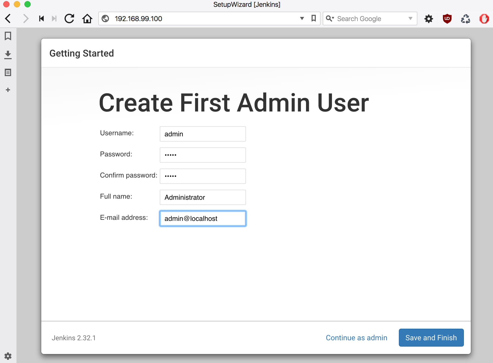

# Jenky


A configurable Docker-ized instance of Jenkins fronted by Nginx.
Convenient for vetting builds in a local development environment.

## Credits

Standing on the shoulders of giants.

I couldn't have scraped this together without
* [A. J. Ricoveri](https://github.com/axltxl/docker-jenkins-dood)
* [Riot Games Engineering](https://engineering.riotgames.com/news/jenkins-ephemeral-docker-tutorial)


## Prerequisites

* Docker


## How to obtain the source

You'll use a git client.

#### with HTTPS

```
git clone https://github.com/fastnsilver/jenky.git
```

#### with SSH

```
git clone git@github.com:fastnsilver/jenky.git
```

## Preparing Docker Machine for first use

Assuming you have installed VirtualBox, Docker Machine, Docker Compose and Docker.

If not, it's highly recommended (on a Mac) to install each via [Homebrew](http://brew.sh/) with

```
brew tap caskroom/cask
brew install brew-cask
brew cask install virtualbox

brew install docker-machine
brew install docker-compose
brew install docker
```

The instruction below provisions a Docker host named `dev` with 2 CPU, 10Gb RAM and 20Gb disk space

```
docker-machine create --driver virtualbox --virtualbox-cpu-count "2" --virtualbox-disk-size "20000" --virtualbox-memory "10240" dev
```

You could also execute the following script which will perform the first step above on your behalf

```
./provision.sh {1}
```

where `{1}` above would be replaced with whatever you want to name your docker-machine

Caveat: You should have at least 12GB of memory and 25GB of disk space on your laptop or workstation.


To begin using it (e.g., where machine name was `dev`)

```
eval $(docker-machine env dev)
```


Lastly, to destroy your docker machine, you could execute

```
./destroy.sh {1}
```

where `{1}` above would be replaced with an existing docker-machine name

Caution! This will remove the VM hosting all your Docker images.


## Notes on makefile

| Command | Description |
|---------|-------------|
| `make build` | Builds images |
| `make run` | Runs images |


## Prep Jenkins instance for first use

```
./bootstrap.sh
```

Visit `http://192.168.99.100`.

You will be prompted to enter a password that is to be retrieved from startup log.


To find it

```
docker ps -a
docker exec -i -t {containerId} /bin/bash
cat /var/jenkins_home/secrets/initialAdminPassword
```

where `{containerId}` is container id of `jenkins_master`.


Enter the value in the `Administrator password` field and click `Continue`.


Next, you will be prompted to install plugins.  


You're advised to click `Install suggested plugins`.

Next, you will be prompted to create an `admin` account.



Click `Save and Finish`.

Upon completion of account creation you can administer your Jenkins instance manually with `Manage Jenkins`.

All updates are persisted to the `jenkins-data` volume.


## Pre-installing plugins

See [Plugin Index](http://updates.jenkins-ci.org/download/plugins/). Add a plugin id for each plugin you wish to install to `plugins.txt`.  You should do this before executing `bootstrap.sh`.  If you wish to install plugins after the image has been built, just do so via `Manage Jenkins > Manage Plugins`.


## Notes on jenkins-master image

It's based on the offical Jenkins Docker image [here](https://hub.docker.com/_/jenkins/).


## Installing GitHub credentials

Visit `https://github.com/settings/tokens` with an authenticated GitHub account.
Click the `Generate new token` button.


Enter a value in `Token description` field. Click on `repo` checkbox. Then click the `Generate token` button.

You will be given a glance at the token.  Copy it!  Store it in a safe location.  You'll need it for the next step.

Visit http://192.168.99.100/credentials/store/system/domain/_/newCredentials


Enter the token value in the `Password` field.  The `Username` field's value should be your GitHub account.  All other field values are flexible.


## Further reading

* Trying to run a "sibling" Docker process as described [here](http://jpetazzo.github.io/2015/09/03/do-not-use-docker-in-docker-for-ci/#the-solution).
* Executing a GitHub pipeline with `Jenkinsfile` when using the [Cloudbees Docker Pipeline Plugin](https://go.cloudbees.com/docs/cloudbees-documentation/cje-user-guide/index.html#docker-workflow-sect-inside).

### Sample golang build pipeline

```
node {
  checkout scm
  sh 'git rev-parse --short HEAD > .rev'
  def rev = readFile('.rev').trim()

  stage ('Run tests, build bin, and package as tarball') {
    docker.image('golang:1.8-wheezy').inside {
      sh 'make tarball'
    }
  }
}
```
